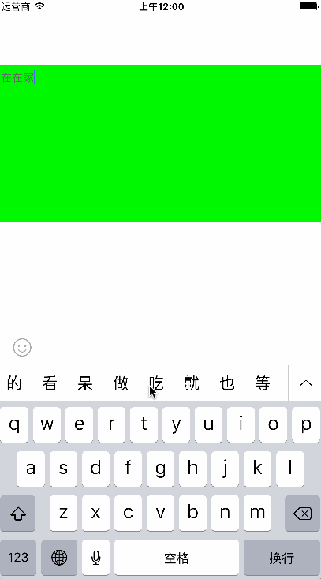
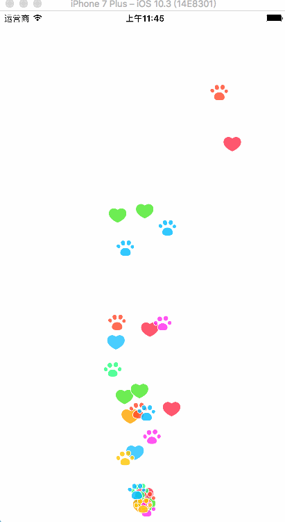

# Tools
一个开发中能用到工具类，包括各种类扩展，一些小功能封装，以及一些动画封装

# 类扩展
## 颜色相关（UIColor的扩展）
- 传入十六进制的颜色值，返回UIColor对象`+(nonnull instancetype)yc_colorWithHex:(u_int32_t)hex`
- 传入0～255的颜色值，返回UIColor对象`+(nonnull instancetype)yc_colorWithRed:(u_int8_t)red green:(u_int8_t)green blue:(u_int8_t)blue` 
- 生成随机颜色`+(nonnull instancetype)yc_randomColor`

## 设备描述 (UIDevice的扩展)
- `+(NSString *)deviceDescription`返回设备描述字符串，如iPhone 6 Plus

## layer层动画控制 (CALayer的扩展)（SWift）
- `func startRotation()`开始旋转动画
- `func pauseAnimation()`暂停动画
- `func resumeAnimation()`恢复动画

## 圆角／带圆环圆角图片 (UIImage的扩展) (Swift)
- `class func circleImage(original: UIImage, clicpBounds: CGRect) -> UIImage`获得圆角图片
- `class func circleImageWithRing(original: UIImage, clicpBounds: CGRect, ringWidth: CGFloat, ringColor: UIColor)  -> UIImage`获得带圆环的圆角图片

## 导航栏全屏滑动返回 (UINavigationController的扩展) (runtime)
- 使用直接拖入分类到项目即可
- `+ (void)load`方法中使用Method Swizzling hook 导航栏的push方法
- 自己实现的push方法中，添加pan手势，pan手势的target和acion分别为系统interactivePopGestureRecognizer手势对应的target和acion

# 工具类
## 弹框提示工具类
- 直接调用类方法 `+(void)showAlertWithTitle:(NSString *)title message:(NSString *)message presentedBy:(id)object itemClickCallBack:(void (^)(NSString *title))callBack cancelTitle:(NSString *)cancelTitle otherTitles:(NSString *)title1,...`
  - title 标题
  - message 信息
  - object 从哪个对象弹出，传空或者传非controller对象，就从keyWindow的根控制器弹出
  - callBack 点击按钮的回调，参数是所点击的按钮的标题
  - cancelTitle 取消按钮标题，取消按钮是最底端按钮，且颜色与其他按钮不一样
  - title1 其他按钮，可以传多个值，以nil结尾

## 表情键盘视图(Swift)
- 自定义YCEmoticonView继承自UIView,使用时，导入YCEmoticonView文件夹到你的工程目录，设置textView.inputView为YCEmoticonView对象，并将textView作为参数传入
- 需要自定义表情素材时，直接修改YCEmoticonView文件夹下的bundle里面的plist文件和导入想入相应表情素材
- 模块里面的表情包括自定义表情与emoji表情
- 模块依赖SnpKit框架
- 写的比较匆忙，后续再格式化代码并完善功能...

# 动画
## 果冻效果（Animation/YCJellyView）
- 直接把YCJellyView添加到想要实现此功能的视图即可

  

## 直播礼物粒子动画效果
- 自定义了一个YCEmitterLayer类，继承自系统CAEmitterLayer类
- 使用时，调用类方法`+ (instancetype)layerWithCenter:(CGPoint)center size:(CGSize)size images:(NSArray *)images`,传入相应参数，并把创建的对象添加到要显示的视图layer上即可

